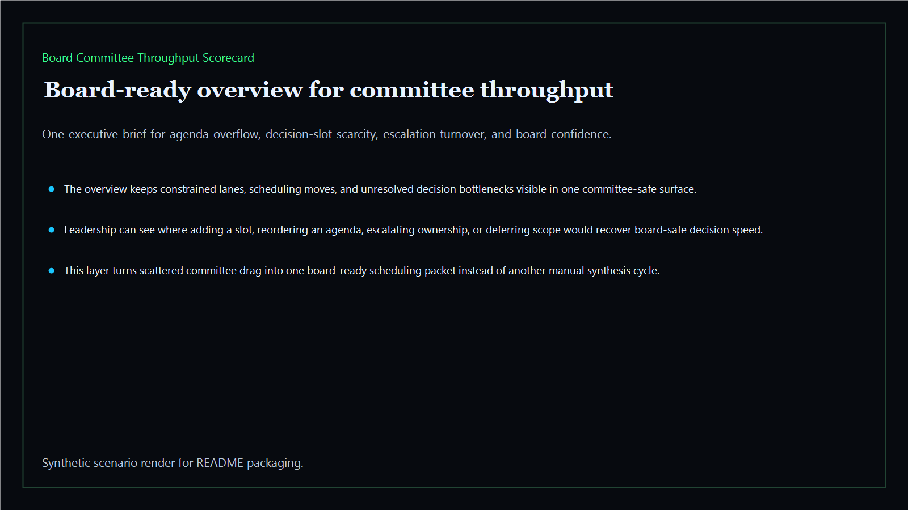
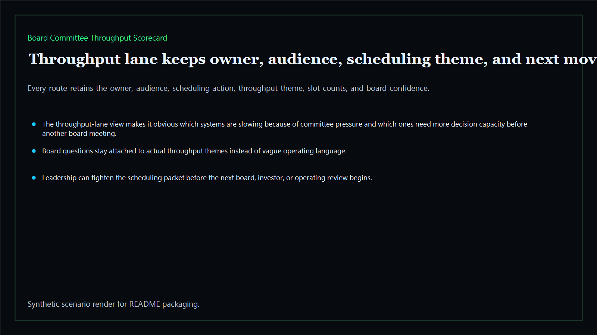
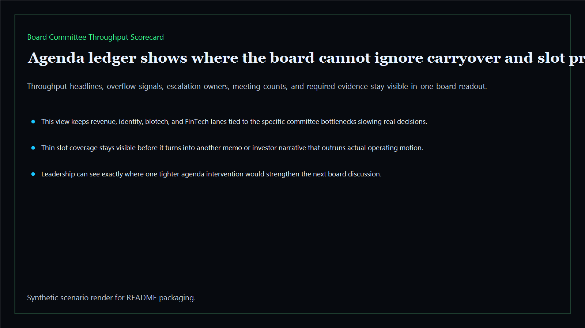
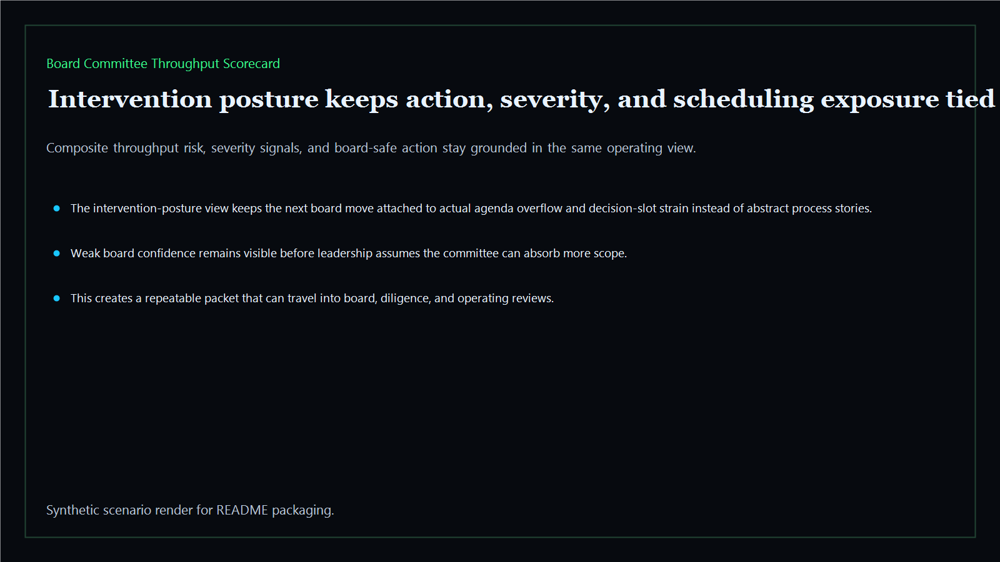

# Board Committee Throughput Scorecard

Board-ready committee-throughput surface for agenda load, decision slots, escalation turnover, and meeting-capacity tradeoffs across the executive estate.

- Live: `https://throughput.kineticgain.com/`
- Repo: `mizcausevic-dev/board-committee-throughput-scorecard`

## Why this matters

Leaders need more than calendars. They need one surface that shows where agenda load, decision-slot scarcity, and escalation turnover are too thin to support the next board-backed move.

## What it includes

- TypeScript executive-intelligence surface for committee throughput with modeled agenda lanes, meeting pressure, decision-slot scarcity, and board-safe intervention posture
- synthetic executive lanes across AI, identity, revenue, FinTech, biotech, procurement, and public-sector readiness
- reusable outputs for throughput lanes, agenda ledgers, intervention packets, and board-ready operating memos
- prerendered static site, JSON payloads, screenshots, and docs

## Routes

- `/`
- `/throughput-lane`
- `/agenda-ledger`
- `/intervention-posture`
- `/verification`
- `/docs`

## Local run

```bash
cd board-committee-throughput-scorecard
npm install
npm run verify
npm run prerender
npm run render:assets
```

## CLI

```bash
npx board-committee-throughput-scorecard fixtures/board-committee-throughput-scorecard.json --format summary
npx board-committee-throughput-scorecard fixtures/board-committee-throughput-scorecard-clean.json --format json
```

## Docs

- [Architecture](docs/architecture.md)
- [Origin](docs/ORIGIN.md)
- [Kinetic Gain Embedded](docs/KINETIC_GAIN_EMBEDDED.md)

## Screenshots





